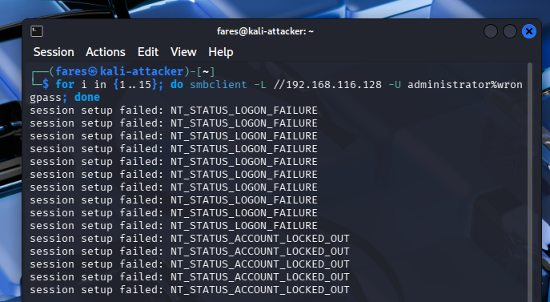
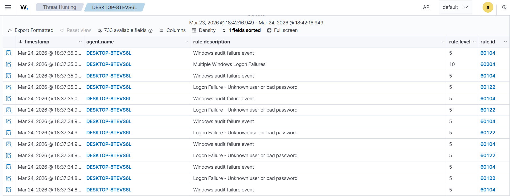
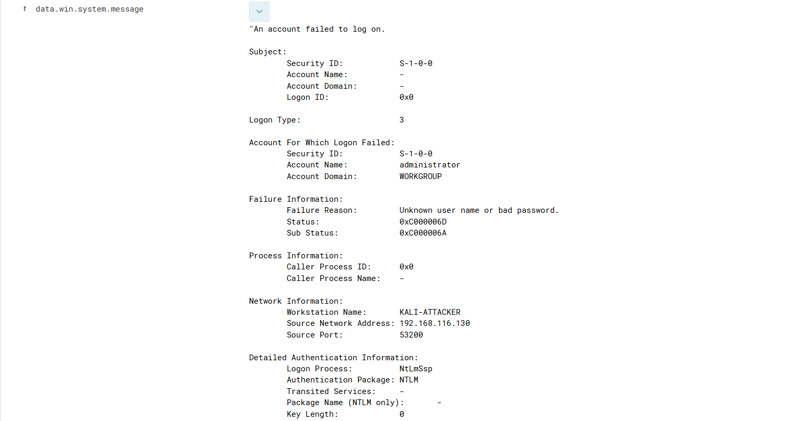
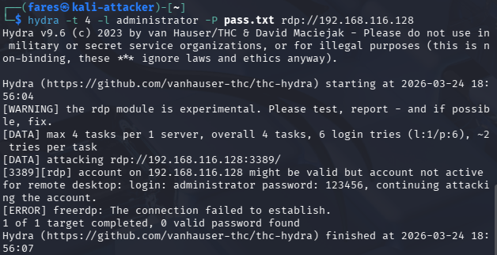
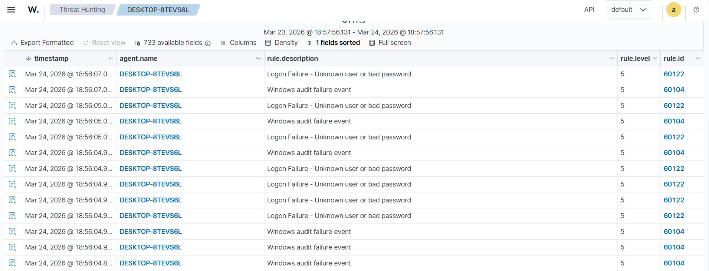
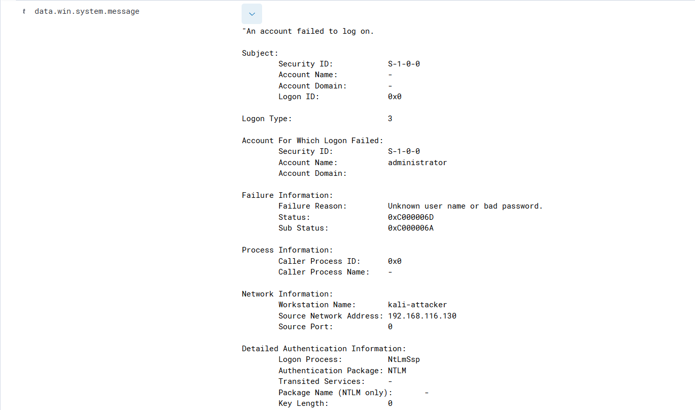

# SOC Home Lab with Wazuh SIEM

## Overview
This project demonstrates a Security Operations Center (SOC) home lab built using Wazuh SIEM. The lab simulates real-world attack scenarios and analyzes how security events are detected, logged, and correlated within a SIEM environment.

## Lab Architecture
-SIEM: Wazuh (Ubuntu)

-Victim Machine: Windows 10

-Attacker Machine: Kali Linux

## Network
- SIEM: 192.168.116.129
- Victim: 192.168.116.128
- Attacker: 192.168.116.130

## Attacks Simulated

### 1. SMB Brute Force Attack
-Repeated authentication attempts using SMB

-Generated multiple failed logon events

-Resulted in account lockout after multiple failures

-Detected in Wazuh with alert severity escalation (Level 5 → Level 10)

### 2. RDP Brute Force Attack
-Simulated login attempts using Hydra

-Generated multiple authentication failures

-Identified as repeated failed logon activity in Wazuh

## Detection & Analysis
-Monitored events through the Wazuh dashboard

-Analyzed Windows Event ID 4625 (failed logon)

-Correlated multiple failed attempts from a single source

-Identified attacker IP and targeted accounts

-Observed alert severity escalation based on attack behavior

## Screenshots
### SMB Brute Force Attack

  
  

### RDP Brute Force Attack

  
  

## Key Findings / What I Learned
-Repeated SMB authentication failures triggered account lockout, confirming brute-force detection via Event ID 4625

-Wazuh increased alert severity when multiple failed attempts occurred in a short time window

-RDP and SMB brute-force attacks produced different log patterns, requiring protocol-specific analysis

-Centralized logging in Wazuh significantly improved visibility and reduced investigation time

## Skills Demonstrated
-SIEM monitoring (Wazuh)

-Log analysis and event correlation

-Attack simulation (SMB, RDP brute force)

-Incident detection and basic investigation

## Future Improvements
-Integrate web application attack detection (Burp Suite)
-Develop custom Wazuh rules for improved detection accuracy
-Expand attack scenarios (privilege escalation, persistence techniques)
